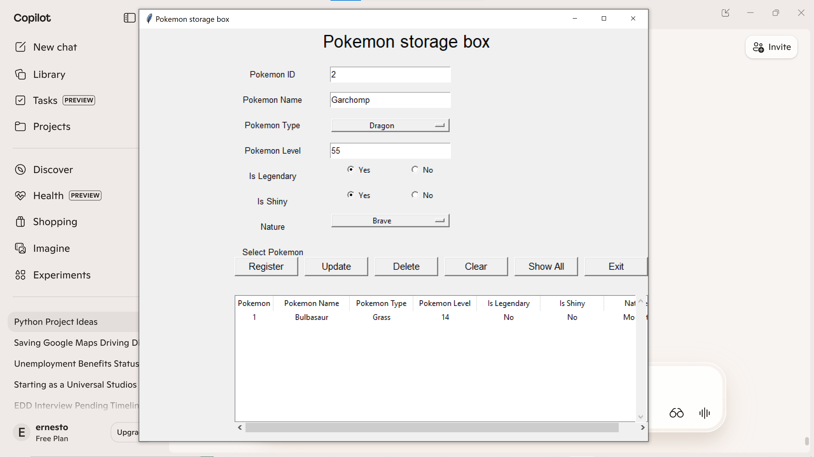
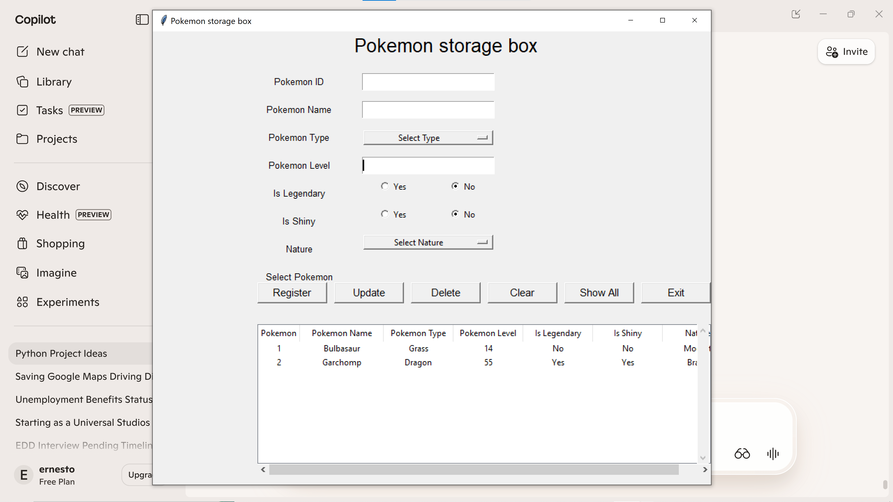
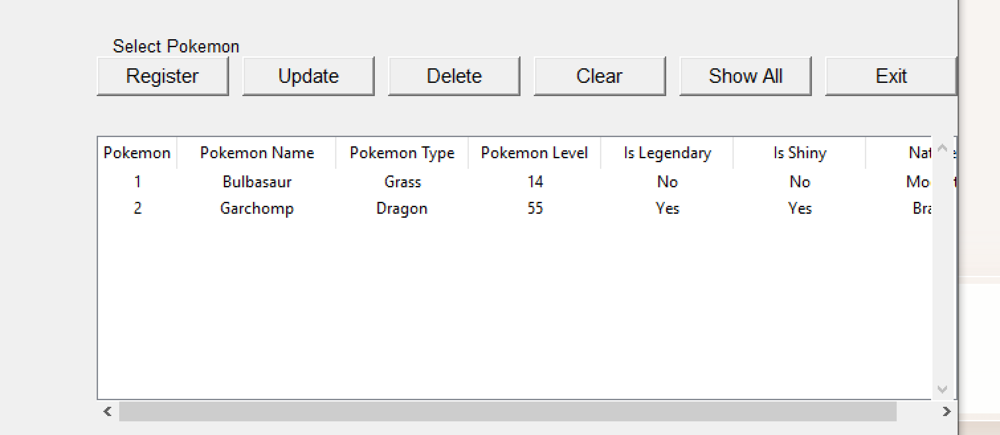

# task-manager-pyth
A Python + Tkinter + SQLite task manager app.

# Pokémon Storage Box — Python CRUD Application

A Python + Tkinter + SQLite application that allows users to Create, Read, Update, and Delete Pokémon entries.  
This project was built as part of a CIS / Python Programming course and demonstrates GUI development, database integration, and CRUD operations.

## 🖼️ Features

- Add new Pokémon
- Update existing Pokémon
- Delete Pokémon
- View all Pokémon in the database
- Select Pokémon from a list
- Boolean fields:
  - Is Legendary
  - Is Shiny
- Dropdown for Pokémon Nature
- SQLite database backend
- Tkinter GUI frontend

## 📸 Screenshots

## 📸 Screenshots

### Main Interface

### Pokémon Entry Example

### Pokémon List Table

The UI includes fields such as:

- **Pokemon Name — Bulbasaur**
- **Pokemon Type — Grass**
- **Is Shiny — Yes**
- **Is Legendary — No**

And buttons such as:

- Register
- Update
- Delete
- Clear
- Show All
- Exit

## 🧱 Tech Stack

- Python 3.14
- Tkinter (GUI)
- SQLite3 (Database)
- Custom CRUD functions

## 📂 Project Structure

## ▶️ How to Run

1. Install Python 3.10+
2. Clone this repository
3. Run:

## 🚀 Future Improvements

- Add Pokémon images
- Add search/filter by type or name
- Add sorting (level, name, shiny first)
- Add export to CSV
- Add login system
